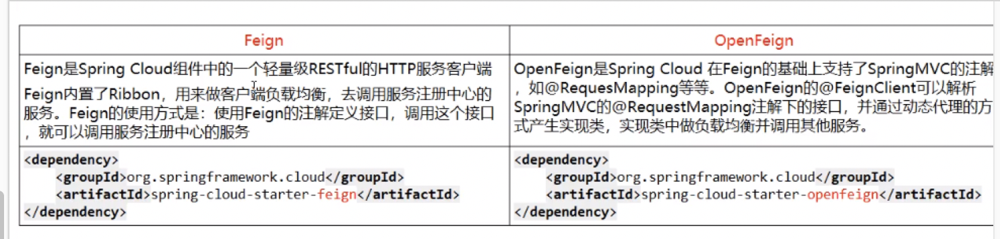

Feign

### 1、简介

#### 1.1、是什么

Feign是一个声明式的Web服务客户端,让编写Web服务客户端变得非常容易,只需创建一个接口并在接口上添加注解即可

#### 1.2、能干什么

Feign 旨在使编写 Java Http 客户端边得更加简单


之前我们使用 Ribbon + RestTemplate时，利用 RestTemplate 对 HTTP请求的封装处理，形成了一套模板化的调用方法。但是在实际的开发过程中，由于对服务依赖的调用可能不止一处，往往一个接口会被多次调用，所以通常都会针对每一个微服务自行封装一些客户端开包装这些依赖服务的调用。所以，Feign 在此基础上做了进一步的封装，由他来帮助我们定义和实现依赖微服务接口的定义。在 Feign 的实现下，我们只需要创建一个接口并使用注解的方式来配置它，即可完成对微服务提供方的接口绑定，简化了使用 Spring cloud Ribbon 时，自动封装服务调用客户端的开发量。

Feign 集成了 Ribbon。

#### 1.3、Feign 和 OpenFeign的区别




### 2、OpenFeign 使用步骤

#### 2.1、接口 + 注解

微服务调用接口 + @FeignClient

#### 2.2、新建cloud-consumer-feign-order80

#### 2.3、POM

```
<?xml version="1.0" encoding="UTF-8"?>
<project xmlns="http://maven.apache.org/POM/4.0.0"
         xmlns:xsi="http://www.w3.org/2001/XMLSchema-instance"
         xsi:schemaLocation="http://maven.apache.org/POM/4.0.0 http://maven.apache.org/xsd/maven-4.0.0.xsd">
    <parent>
        <artifactId>mycloud2020</artifactId>
        <groupId>com.wmding.springcloud</groupId>
        <version>1.0-SNAPSHOT</version>
    </parent>
    <modelVersion>4.0.0</modelVersion>

    <artifactId>cloud-consumer-feign-order80</artifactId>
    <description>订单消费者之 feign</description>

    <dependencies>
        <!--openfeign-->
        <dependency>
            <groupId>org.springframework.cloud</groupId>
            <artifactId>spring-cloud-starter-openfeign</artifactId>
        </dependency>
        <dependency>
            <groupId>org.springframework.cloud</groupId>
            <artifactId>spring-cloud-starter-netflix-eureka-server</artifactId>
            <exclusions>
                <exclusion>
                    <groupId>com.fasterxml.jackson.dataformat</groupId>   
                    <artifactId>jackson-dataformat-xml</artifactId>
                </exclusion>
            </exclusions>
        </dependency>
        <dependency>
            <groupId>com.wmding.springcloud</groupId>
            <artifactId>cloud-api-common</artifactId>
            <version>${project.version}</version>
        </dependency>
        <dependency>
            <groupId>org.springframework.boot</groupId>
            <artifactId>spring-boot-starter-web</artifactId>
        </dependency>
        <!--监控-->
        <dependency>
            <groupId>org.springframework.boot</groupId>
            <artifactId>spring-boot-starter-actuator</artifactId>
        </dependency>
        <!--热部署-->
        <dependency>
            <groupId>org.springframework.boot</groupId>
            <artifactId>spring-boot-devtools</artifactId>
            <scope>runtime</scope>
            <optional>true</optional>
        </dependency>
        <dependency>
            <groupId>org.projectlombok</groupId>
            <artifactId>lombok</artifactId>
            <optional>true</optional>
        </dependency>
        <dependency>
            <groupId>org.springframework.boot</groupId>
            <artifactId>spring-boot-starter-test</artifactId>
        </dependency>
    </dependencies>


</project>
```


#### 2.4、YML

```
server:
  port: 80

eureka:
  client:
    register-with-eureka: true
    fetch-registry: true
    service-url:
      #defaultZone: http://localhost:7001/eureka
      # 集群版
      defaultZone: http://localhost:7001/eureka,http://localhost:7002/eureka
  instance:
    instance-id: order80
    # 访问路径可以显示ip地址
    prefer-ip-address: true
```

#### 2.5、主启动类

```
@SpringBootApplication
@EnableEurekaClient
@EnableFeignClients
public class OrderFeignMain80 {
    public static void main(String[] args) {
        SpringApplication.run(OrderFeignMain80.class, args);
    }
}
```


#### 2.6业务类

##### 2.6.1、业务逻辑接口 + @FeignClient

```
@Component
@FeignClient(value = "CLOUD-PAYMENT-SERVICE")
public interface PaymentFeignService {

    /**
     * 根据id查询
     *
     * @param id
     * @return
     */
    @GetMapping(value = "payment/get/{id}")
    CommonResult getPaymentById(@PathVariable("id") Long id);

    /**
     * 模拟feign超时
     *
     * @return
     */
    @GetMapping(value = "/payment/feign/timeout")
    String paymentFeignTimeout();
}
```


##### 2.6.2、Controller

```
@RestController
@Slf4j
public class OrderFeignClientController {
    @Resource
    private PaymentFeignService paymentFeignService;

    @GetMapping(value = "/consumer/payment/get/{id}")
    public CommonResult<Payment> getPaymentById(@PathVariable("id") Long id) {
        return paymentFeignService.getPaymentById(id);
    }

    @GetMapping(value = "/consumer/payment/feign/timeout")
    public String paymentFeignTimeout() {
        // openfeign-ribbon, 客户端一般默认等待1秒钟
        return paymentFeignService.paymentFeignTimeout();
    }
}
```


#### 2.6、测试

- 先启动2个eureka集群7001/7002
- 再启动2个微服务8001/8002
- 启动OpenFeign（cloud-consumer-feign-order80）
- 访问服务地址：http://localhost/consumer/payment/get/31
- Feign 自带负载均衡配置项

### 3、OpenFeign 超时控制

#### 3.1、超时设置，在服务提供中写一个耗时的操作，然后消费者服务进行调用

1、在 cloud-provider-payment8001、cloud-provider-payment8002 中添加服务接口

```
@GetMapping(value = "/payment/feign/timeout")
    public String paymentFeignTimeout() {
        try {
            // 暂停3秒钟
            TimeUnit.SECONDS.sleep(3);
        } catch (InterruptedException e) {
            e.printStackTrace();
        }
        return port;
    }
```


2、在cloud-consumer-feign-order80中添加服务进行消费

```
@GetMapping(value = "/consumer/payment/feign/timeout")
public String paymentFeignTimeout() {
  // openfeign-ribbon, 客户端一般默认等待1秒钟
  return paymentFeignService.paymentFeignTimeout();
}
```


3、进行访问，出现超时的情况


#### 3.2、OpenFeign 默认等待时间为 1 秒钟，超时后会报错

默认 Feign 客户端只等待一秒钟，但是服务端处理需要超过1秒钟，导致 Feign 客户端不想等待了，直接返回了错误，为了避免这个情况，我们需要设置 Feign 客户端的超时控制。

#### 3.3、设置超时控制

在 yml 文件中进行设置，